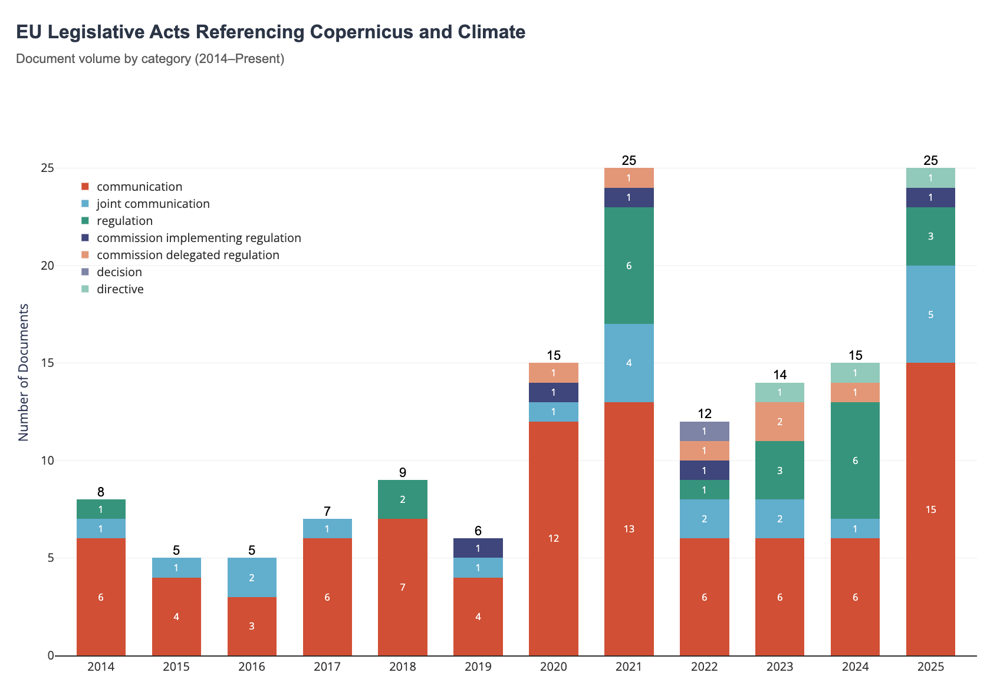

# copernicus-climate-eur-lex-viz

A quick visualization repo for data exports from EUR-LEX.

## Convenient workflow with [EUR-LEX dataset on Huggingface](https://huggingface.co/datasets/do-me/eur-lex)

This is a one-time setup:

1. Clone this repository with `git clone https://github.com/do-me/copernicus-climate-eur-lex-viz.git` then run `cd copernicus-climate-eur-lex-viz` to change the directory
2. Clone the full dataset (6.5Gb) with `git clone https://huggingface.co/datasets/do-me/EUR-LEX` this will take 10 to 60 mins depending on your internet connection.
3. Install [uv](https://docs.astral.sh/uv/getting-started/installation/) on your system
4. Run the script with `uv run extract.py`. This should take no more than 15 seconds. 

This will overwrite the `index.html` file you can open in the browser. 



## Data updates

If you downloaded the Hugggingface dataset already, you can simply pull any updates which will be really fast. 

1. Run `cd copernicus-climate-eur-lex-viz/EUR-LEX` to change the directory
2. Update the dataset with `git pull`
3. Run the script with `uv run extract.py`. This should take no more than 15 seconds. 

## Modifiying the SQL

You can find the SQL used to query the full texts in `extract.py`

This WHERE statement can easily be modified: 

```sql
WHERE 
    CAST(date AS DATE) >= '2014-01-01'
    
    -- 1. Must contain Copernicus
    AND regexp_matches(text, '(?i)copernicus')
    
    -- 2. AND must contain ANY of these words
    AND regexp_matches(text, '(?i)climate|carbon|ghg|emissions')
            
    -- 3. AND title must start with ANY of these words
    AND regexp_matches(title, '^(?i)(decision|regulation|directive|communication|joint communication|commission delegated regulation|commission implementing regulation)')
```

<details>
  <summary>Old workflow with exports directly from EUR-LEX (not recommended due to errors in EUR LEX csv exports as of Feb/2026</summary>
  

1. Request data (signed-in) under [this URL](https://eur-lex.europa.eu/search.html?SUBDOM_INIT=ALL_ALL&DTS_SUBDOM=ALL_ALL&sortOneOrder=desc&textScope0=ti-te&DTS_DOM=ALL&sortOne=DD&textScope1=ti-te&lang=en&type=advanced&qid=1770050647082&andText1=climate&andText0=copernicus) (for search terms Climate and Copernicus) as of 3.2.2026 it holds 1272 results
2. Data is very dirty and malformated. The csv is broken as cells are not properly sanitized.
3. Convert the csv to excel, manually clean the columns 'Title', 'Subtitle', 'CELEX number', 'Date of document' (sometimes they are simply shifted by n columns to the right)
4. Run script for preprocessing, deduplicating and filtering
5. Update the index.html here.

Documents included: 

```python
important_eu_document_types = [
    "Treaty",
    "Regulation",
    "Directive",
    "Decision",
    "Delegated regulation",
    "Implementing regulation",
    "Implementing decision",
    "Communication",
    "Joint communication",
    "Strategy",
]
```

Yearly view: 


</details>

